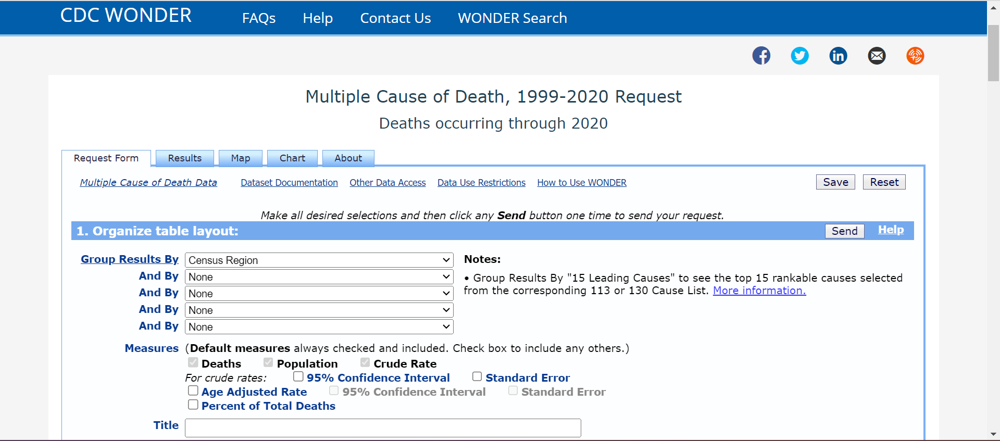

# Data Resource
 - *Center for Disease Control and Prevention*: *https://wonder.cdc.gov/mcd-icd10.html* for information on different causes of mortality 
 - paper Zigler : ADD REFERENCE PAPER AND HOW TO DOWNLOAD DATASET for level of $PM_{2.5}$ and air pollution regolation

### How to download the data from *Center for Disease Control and Prevention*
Google *https://wonder.cdc.gov/mcd-icd10.html*, agree terms of data use, and this page apare

 Follow this indications:
 - in **`1. Organize table layout`**: modify
   - group results by: COUNTY
   - measures for crude rates: Age Adjusted Rate
 - in **`2. Select location`**: default values
 - in **`3. Select demographics`**: default values
 - in **`4. Select year and month`**: select all the years interested (we have download one a dataset for 2000-2005 and a second one for 2010-2016)
 - in **`5. Select weekday, autopsy and place of death`**: default values
 - in **`6. Select underlying cause of death`**: select the interested cause (we have download differend dataset, each time selecting a different cause: all causes of death, mental and behavioural disorders, diseases of the nervous system, diseases of the circulatory system, diseases of the respiratory system, and congenital malformations)
- in **`7. Select multiple cause of death`**: default values
- in **`8. Other options`**: selected
  - Show Zero Values
  - Show Suppressed Values	
  - precision: 3 decimal places 

